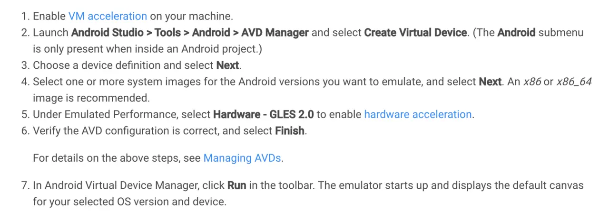
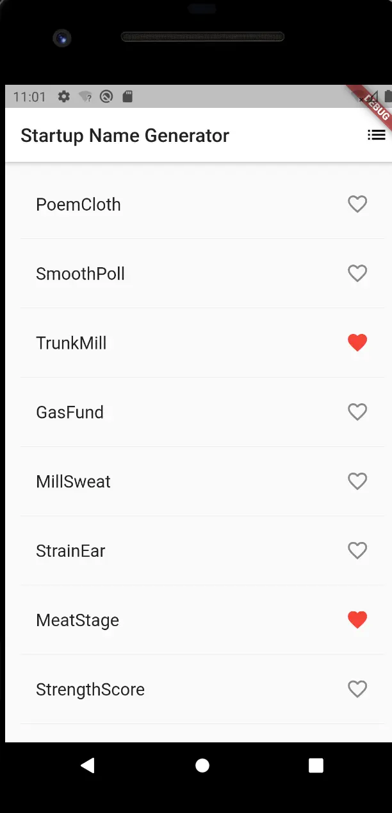

# flutter快速开始

## 环境搭建

### macOS Mojave

1. [下载sdk](https://storage.googleapis.com/flutter_infra/releases/stable/macos/flutter_macos_v1.9.1+hotfix.4-stable.zip)
2. 解压：`unzip flutter_macos_v1.9.1+hotfix.4-stable.zip`
3. 配置环境变量

    ```sh
    # vim ~/.bash_profile
    export PATH=$PATH:$YOUR_UNZIP_PATH/Desktop/flutter/bin
    export PUB_HOSTED_URL=https://pub.flutter-io.cn
    export FLUTTER_STORAGE_BASE_URL=https://storage.flutter-io.cn
    # source ~/.bash_profile
    ```

4. [下载AndroidStudio](https://dl.google.com/dl/android/studio/install/3.5.1.0/android-studio-ide-191.5900203-mac.dmg) 下载完成后打开一路next到finish

    > This installs the latest Android SDK, Android SDK Platform-Tools, and Android SDK Build-Tools, which are required by Flutter when developing for Android.
5. 新建安卓模拟器

    

    *注*：
        - AndroidStudio 右上角手机的图标就是 avd manager
6. 安装vscode插件**Flutter**
7. vscode -> cmd + shift + p -> flutter: new project  
    - 如果提示找不到flutter sdk，确认上面的操作都执行的话，试试重启电脑
8. flutter run卡在ResolveDependencies的解决办法

    下载[gradle-4.10.2-all.zip](http://services.gradle.org/distributions/gradle-4.10.2-all.zip),解压到~/.gradle/wrapper/dists/gradle-4.10.2-all/9fahxiiecdb76a5g3aw9oi8rv

## demo尝鲜

```dart
// Copyright 2018 The Flutter team. All rights reserved.
// Use of this source code is governed by a BSD-style license that can be
// found in the LICENSE file.

import 'package:flutter/material.dart';
import 'package:english_words/english_words.dart';

void main() => runApp(MyApp());

// #docregion MyApp
class MyApp extends StatelessWidget {
  // #docregion build
  @override
  Widget build(BuildContext context) {
    return MaterialApp(
      title: 'Startup Name Generator',
      theme: ThemeData(
        primaryColor: Colors.white,
      ),
      home: RandomWords(),
    );
  }
  // #enddocregion build
}
// #enddocregion MyApp

// #docregion RWS-var
class RandomWordsState extends State<RandomWords> {
  final _suggestions = <WordPair>[];
  final Set<WordPair> _saved = Set<WordPair>();
  final _biggerFont = const TextStyle(fontSize: 18.0);
  // #enddocregion RWS-var

  // #docregion _buildSuggestions
  Widget _buildSuggestions() {
    return ListView.builder(
        padding: const EdgeInsets.all(16.0),
        itemBuilder: /*1*/ (context, i) {
          if (i.isOdd) return Divider(); /*2*/

          final index = i ~/ 2; /*3*/
          if (index >= _suggestions.length) {
            _suggestions.addAll(generateWordPairs().take(10)); /*4*/
          }
          return _buildRow(_suggestions[index]);
        });
  }
  // #enddocregion _buildSuggestions

  // #docregion _buildRow
  Widget _buildRow(WordPair pair) {
    final bool alreadySaved = _saved.contains(pair);
    return ListTile(
      title: Text(
        pair.asPascalCase,
        style: _biggerFont,
      ),
      trailing: Icon(
        alreadySaved ? Icons.favorite : Icons.favorite_border,
        color: alreadySaved ? Colors.red : null,
      ),
      onTap: () {
        setState(() {
          if (alreadySaved) {
            _saved.remove(pair);
          } else {
            _saved.add(pair);
          }
        });
      },
    );
  }
  // #enddocregion _buildRow

  // #docregion RWS-build
  @override
  Widget build(BuildContext context) {
    return Scaffold(
      appBar: AppBar(
        title: Text('Startup Name Generator'),
        actions: <Widget>[
          IconButton(icon: Icon(Icons.list), onPressed: _pushSaved),
        ],
      ),
      body: _buildSuggestions(),
    );
  }
  // #enddocregion RWS-build

  void _pushSaved() {
    Navigator.of(context).push(
      MaterialPageRoute<void>(
        // Add 20 lines from here...
        builder: (BuildContext context) {
          final Iterable<ListTile> tiles = _saved.map(
            (WordPair pair) {
              return ListTile(
                title: Text(
                  pair.asPascalCase,
                  style: _biggerFont,
                ),
              );
            },
          );
          final List<Widget> divided = ListTile.divideTiles(
            context: context,
            tiles: tiles,
          ).toList();

          return Scaffold(
            appBar: AppBar(
              title: Text('Saved Suggestions'),
            ),
            body: ListView(children: divided),
          );
        },
      ),
    );
  }
  // #docregion RWS-var
}
// #enddocregion RWS-var

class RandomWords extends StatefulWidget {
  @override
  RandomWordsState createState() => RandomWordsState();
}
```

最终效果：


