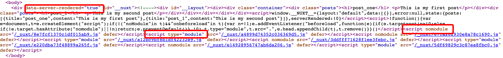

# nuxt简介

## 服务端渲染方案

### what

在服务端生成html静态字符串，发送到客户端，再混合成可交互的app


### why

- 减少首屏时间
- SEO

### 缺点

- 开发限制
- 更多的构建部署要求
- 加大服务器负载

参考链接

1. [vue ssr guide](https://ssr.vuejs.org/)
2. [vue ssr demo](https://github.com/vuejs/vue-hackernews-2.0/)

## dev 主流程

### 构建时

- getNuxtConfig获取配置，优先级是命令行参数 > 配置文件 > 默认配置
- getNuxt获取Nuxt实例
- setup hooks，Nuxt继承自[hable](https://www.npmjs.com/package/hable)
- 初始化nuxt,其中包括初始化moduleContainer和server
- 启动server listeners
- 控制台打印listeners启动消息
- 浏览器自动打开页面（可选）
- 获取builder实例并构建
- 控制台打印内存使用

```js
// packages/cli/src/commands/dev.js
async _startDev (cmd, argv) {
    const config = await cmd.getNuxtConfig({ dev: true, _build: true })
    const nuxt = await cmd.getNuxt(config)

    // Setup hooks
    nuxt.hook('watch:restart', payload => this.onWatchRestart(payload, { nuxt, cmd, argv }))
    nuxt.hook('bundler:change', changedFileName => this.onBundlerChange(changedFileName))

    // Wait for nuxt to be ready
    await nuxt.ready()

    // Start listening
    await nuxt.server.listen()

    // Show banner when listening
    showBanner(nuxt, false)

    // Opens the server listeners url in the default browser (only once)
    if (argv.open) {
      argv.open = false
      const openerPromises = nuxt.server.listeners.map(listener => opener(listener.url))
      await Promise.all(openerPromises)
    }

    // Create builder instance
    const builder = await cmd.getBuilder(nuxt)

    // Start Build
    await builder.build()

    // Print memory usage
    showMemoryUsage()

    // Return instance
    return nuxt
  },
```

- 初始化nuxt,其中包括初始化moduleContainer和server

```js
// packages/core/src/nuxt.js
async _init () {
    if (this._initCalled) {
      return this
    }
    this._initCalled = true

    // Add hooks
    if (isPlainObject(this.options.hooks)) {
      this.addHooks(this.options.hooks)
    } else if (typeof this.options.hooks === 'function') {
      this.options.hooks(this.hook)
    }

    // Await for modules
    await this.moduleContainer.ready()

    // Await for server to be ready
    if (this.server) {
      await this.server.ready()
    }

    // Call ready hook
    await this.callHook('ready', this)

    return this
  }
```

- moduleContainer顺序加载buildModules和modules

```js
// packages/core/src/module.js
async ready () {
    // Call before hook
    await this.nuxt.callHook('modules:before', this, this.options.modules)

    if (this.options.buildModules && !this.options._start) {
      // Load every devModule in sequence
      await sequence(this.options.buildModules, this.addModule.bind(this))
    }

    // Load every module in sequence
    await sequence(this.options.modules, this.addModule.bind(this))

    // Call done hook
    await this.nuxt.callHook('modules:done', this)
  }

```

- server.ready主要做是注册中间件，在此之前要初始化vueRenderer

```js
// packages/server/src/server.js
async ready () {
    // ...
    this.serverContext = new ServerContext(this)
    this.renderer = new VueRenderer(this.serverContext)
    await this.renderer.ready()
    // Setup nuxt middleware
    await this.setupMiddleware()
  }
```

- vue-renderer的初始化主要做一件事：加载资源

```js
// packages/vue-renderer/src/renderer.js
async _ready () {
    // Resolve dist path
    this.distPath = path.resolve(this.options.buildDir, 'dist', 'server')

    // -- Development mode --
    if (this.options.dev) {
      this.serverContext.nuxt.hook('build:resources', mfs => this.loadResources(mfs))
      return
    }

    // -- Production mode --

    // Try once to load SSR resources from fs
    await this.loadResources(fs)
// ...
}
```

- http.createServer(app).listen()

```js
// packages/server/src/listener.js
async listen () {
    // ...
    // Initialize underlying http(s) server
    const protocol = this.https ? https : http
    const protocolOpts = this.https ? [this.https] : []
    this._server = protocol.createServer.apply(protocol, protocolOpts.concat(this.app))

    // Call server.listen
    // Prepare listenArgs
    const listenArgs = this.socket ? { path: this.socket } : { host: this.host, port: this.port }
    listenArgs.exclusive = false

    // Call server.listen
    try {
      this.server = await new Promise((resolve, reject) => {
        this._server.on('error', error => reject(error))
        const s = this._server.listen(listenArgs, error => error ? reject(error) : resolve(s))
      })
    } catch (error) {
      return this.serverErrorHandler(error)
    }
  }
```

- 获取buider实例并构建, 主要做的事情是：
  - 创建.nuxt目录和components子目录，生产环境的话会创建dist/server, dist/client子目录
  - 解析layouts目录，填充`templateVars.layouts`
  - 解析pages目录，填充 `templateVars.router.routes`
  - 解析store目录，填充`templateVars.storeModules`
  - 解析middleware目录，填充`templateVars.middleware`
  - 添加可选模版文件`nuxt-build-indicator.vue`和`nuxt-loading.vue`
  - 添加自定义模版文件到templateFiles,
  - 添加loading.html到templateFiles,
  - 编译模版并输出编译后的文件到.nuxt目录
  - 处理插件
  - webpack打包

```js
// packages/builder/src/builder.js
async build () {
    // ...
    // Call before hook
    await this.nuxt.callHook('build:before', this, this.options.build)
    // ...
    // Create .nuxt/, .nuxt/components and .nuxt/dist folders
    await fsExtra.remove(r(this.options.buildDir))
    const buildDirs = [r(this.options.buildDir, 'components')]
    if (!this.options.dev) {
      buildDirs.push(
        r(this.options.buildDir, 'dist', 'client'),
        r(this.options.buildDir, 'dist', 'server')
      )
    }
    await Promise.all(buildDirs.map(dir => fsExtra.mkdirp(dir)))

    // Call ready hook
    await this.nuxt.callHook('builder:prepared', this, this.options.build)

    // Generate routes and interpret the template files
    await this.generateRoutesAndFiles()

    await this.resolvePlugins()

    // Start bundle build: webpack, rollup, parcel...
    await this.bundleBuilder.build()

    // Flag to set that building is done
    this._buildStatus = STATUS.BUILD_DONE

    // Call done hook
    await this.nuxt.callHook('build:done', this)

    return this
  }
```

```js
// packages/builder/src/builder.js
async generateRoutesAndFiles () {
    consola.debug('Generating nuxt files')

    if (this.bundleBuilder) {
      this.bundleBuilder.pauseWatch()
    }

    this.plugins = Array.from(await this.normalizePlugins())

    const templateContext = this.createTemplateContext()

    await Promise.all([
      this.resolveLayouts(templateContext),
      this.resolveRoutes(templateContext),
      this.resolveStore(templateContext),
      this.resolveMiddleware(templateContext)
    ])

    this.addOptionalTemplates(templateContext)

    await this.resolveCustomTemplates(templateContext)

    await this.resolveLoadingIndicator(templateContext)

    // Add vue-app template dir to watchers
    this.options.build.watch.push(this.globPathWithExtensions(this.template.dir))

    await this.compileTemplates(templateContext)

    if (this.bundleBuilder) {
      this.bundleBuilder.resumeWatch()
    }

    consola.success('Nuxt files generated')
  }
```

- 模版是指在文件中嵌入变量， vue-app包的模版目录存放默认的模版文件，用模版变量编译生成最终需要的文件

```js
// packages/builder/src/context/template.js
export default class TemplateContext {
  constructor (builder, options) {
    this.templateFiles = Array.from(builder.template.files)
    this.templateVars = {
      nuxtOptions: options,
      features: options.features,
      extensions: options.extensions
        .map(ext => ext.replace(/^\./, ''))
        .join('|'),
      messages: options.messages,
      splitChunks: options.build.splitChunks,
      uniqBy,
      isDev: options.dev,
      isTest: options.test,
      debug: options.debug,
      buildIndicator: options.dev && options.build.indicator,
      vue: { config: options.vue.config },
      fetch: options.fetch,
      mode: options.mode,
      router: options.router,
      env: options.env,
      head: options.head,
      store: options.features.store ? options.store : false,
      globalName: options.globalName,
      globals: builder.globals,
      css: options.css,
      plugins: builder.plugins,
      appPath: './App.js',
      layouts: Object.assign({}, options.layouts),
      loading:
        typeof options.loading === 'string'
          ? builder.relativeToBuild(options.srcDir, options.loading)
          : options.loading,
      pageTransition: options.pageTransition,
      layoutTransition: options.layoutTransition,
      rootDir: options.rootDir,
      srcDir: options.srcDir,
      dir: options.dir,
      components: {
        ErrorPage: options.ErrorPage
          ? builder.relativeToBuild(options.ErrorPage)
          : null
      }
    }
  }
```

- 默认模版文件

```js
// packages/vue-app/src/index.js
export const template = {
  dependencies,
  dir: path.join(__dirname, '..', 'template'),
  files: [
    'App.js',
    'client.js',
    'index.js',
    'router.js',
    'router.scrollBehavior.js',
    'server.js',
    'utils.js',
    'empty.js',
    'components/nuxt-error.vue',
    'components/nuxt-child.js',
    'components/nuxt-link.server.js',
    'components/nuxt-link.client.js',
    'components/nuxt.js',
    'views/app.template.html',
    'views/error.html'
  ]
}
```

- this.bundleBuilder.build()是调用webpack来构建, entry为`.nuxt/server.js`, 使用`VueSSRServerPlugin`输出`server.manifest.json`

```js
// packages/webpack/src/builder.js
async build () {
    const { options } = this.buildContext

    const webpackConfigs = [
        this.getWebpackConfig('Client')
    ]

    if (options.modern) {
        webpackConfigs.push(this.getWebpackConfig('Modern'))
    }

    if (options.build.ssr) {
        webpackConfigs.push(this.getWebpackConfig('Server'))
    }

    await this.buildContext.nuxt.callHook('webpack:config', webpackConfigs)
    // ...
    // Configure compilers
    this.compilers = webpackConfigs.map((config) => {
        const compiler = webpack(config)

        // In dev, write files in memory FS
        if (options.dev) {
        compiler.outputFileSystem = this.mfs
        }

        return compiler
    })

    // ...

    // Start Builds
    const runner = options.dev ? parallel : sequence

    await runner(this.compilers, compiler => this.webpackCompile(compiler))
}
```

- 利用[tapable](https://github.com/webpack/tapable)在done钩子里调用nuxt加载资源的钩子

```js
// packages/webpack/src/builder.js
 async webpackCompile (compiler) {
    const { name } = compiler.options
    const { nuxt, options } = this.buildContext

    await nuxt.callHook('build:compile', { name, compiler })

    // Load renderer resources after build
    compiler.hooks.done.tap('load-resources', async (stats) => {
      await nuxt.callHook('build:compiled', {
        name,
        compiler,
        stats
      })

      // Reload renderer
      await nuxt.callHook('build:resources', this.mfs)
    })

    // --- Dev Build ---
    if (options.dev) {
      // Client Build, watch is started by dev-middleware
      if (['client', 'modern'].includes(name)) {
        return new Promise((resolve, reject) => {
          compiler.hooks.done.tap('nuxt-dev', () => resolve())
          return this.webpackDev(compiler)
        })
      }

      // Server, build and watch for changes
      return new Promise((resolve, reject) => {
        const watching = compiler.watch(options.watchers.webpack, (err) => {
          if (err) {
            return reject(err)
          }
          watching.close = pify(watching.close)
          this.compilersWatching.push(watching)
          resolve()
        })
      })
    }

    // --- Production Build ---
    compiler.run = pify(compiler.run)
    const stats = await compiler.run()

    if (stats.hasErrors()) {
      // non-quiet mode: errors will be printed by webpack itself
      const error = new Error('Nuxt build error')
      if (options.build.quiet === true) {
        error.stack = stats.toString('errors-only')
      }
      throw error
    }

    // Await for renderer to load resources (programmatic, tests and generate)
    await nuxt.callHook('build:resources')
  }
```

- 同样利用hable钩子注册dev环境server运行时中间件：[webpack-dev-middleware](https://www.npmjs.com/package/webpack-dev-middleware) [webpack-hot-middleware](https://www.npmjs.com/package/webpack-hot-middleware)

```js
// packages/webpack/src/builder.js
  async webpackDev (compiler) {
    consola.debug('Creating webpack middleware...')

    const { name } = compiler.options
    const buildOptions = this.buildContext.options.build
    const { client, ...hotMiddlewareOptions } = buildOptions.hotMiddleware || {}

    // Create webpack dev middleware
    this.devMiddleware[name] = pify(
      webpackDevMiddleware(
        compiler, {
          publicPath: buildOptions.publicPath,
          stats: false,
          logLevel: 'silent',
          watchOptions: this.buildContext.options.watchers.webpack,
          ...buildOptions.devMiddleware
        })
    )

    this.devMiddleware[name].close = pify(this.devMiddleware[name].close)

    this.compilersWatching.push(this.devMiddleware[name].context.watching)

    this.hotMiddleware[name] = pify(
      webpackHotMiddleware(
        compiler, {
          log: false,
          heartbeat: 10000,
          path: `/__webpack_hmr/${name}`,
          ...hotMiddlewareOptions
        })
    )

    // Register devMiddleware on server
    await this.buildContext.nuxt.callHook('server:devMiddleware', this.middleware)
  }

  async middleware (req, res, next) {
    const name = isModernRequest(req, this.buildContext.options.modern) ? 'modern' : 'client'

    if (this.devMiddleware && this.devMiddleware[name]) {
      await this.devMiddleware[name](req, res)
    }

    if (this.hotMiddleware && this.hotMiddleware[name]) {
      await this.hotMiddleware[name](req, res)
    }

    next()
  }
```

- server构造时hook

```js
  // packages/server/src/server.js
  constructor() {
    // ...
    // devMiddleware placeholder
    if (this.options.dev) {
      this.nuxt.hook('server:devMiddleware', (devMiddleware) => {
        this.devMiddleware = devMiddleware
      })
    }
  }
```

### 运行时

- 内置connect处理请求会依次执行注册的中间件，最后两个中间件是nuxtMiddleware 和 errorMiddleware, nuxtMiddleware调用vue-renderer 的renderRoute方法完成渲染

```js
// packages/server/src/server.js
async setupMiddleware () {
    // Apply setupMiddleware from modules first
    await this.nuxt.callHook('render:setupMiddleware', this.app)
    if (!this.options.dev) {
        // ...
        this.useMiddleware(compressor)
        // ...
      }
    }
    // ...
    this.useMiddleware(staticMiddleware)
    // ...
    // Dev middleware
    if (this.options.dev) {
      this.useMiddleware((req, res, next) => {
        if (!this.devMiddleware) {
          return next()
        }
        this.devMiddleware(req, res, next)
      })
        // ...
    }
    // Add user provided middleware
    for (const m of this.options.serverMiddleware) {
      this.useMiddleware(m)
    }
    // ...
    // Finally use nuxtMiddleware
    this.useMiddleware(nuxtMiddleware({
      options: this.options,
      nuxt: this.nuxt,
      renderRoute: this.renderRoute.bind(this),
      resources: this.resources
    }))

    // Apply errorMiddleware from modules first
    await this.nuxt.callHook('render:errorMiddleware', this.app)

    // Error middleware for errors that occurred in middleware that declared above
    this.useMiddleware(errorMiddleware({
      resources: this.resources,
      options: this.options
    }))
  }
```

- nuxtMiddleware调用renderRoute进行服务端渲染完成响应

```js
// packages/server/src/middleware/nuxt.js
export default ({ options, nuxt, renderRoute, resources }) => async function nuxtMiddleware (req, res, next) {
  // ...
  try {
    const result = await renderRoute(url, context)
    await nuxt.callHook('render:route', url, result, context)
    // ...
    const {
      html,
      cspScriptSrcHashes,
      error,
      redirected,
      preloadFiles
    } = result
    // ...
    // Send response
    res.setHeader('Content-Type', 'text/html; charset=utf-8')
    res.setHeader('Accept-Ranges', 'none') // #3870
    res.setHeader('Content-Length', Buffer.byteLength(html))
    res.end(html, 'utf8')
    await nuxt.callHook('render:routeDone', url, result, context)
    return html
  } catch (err) {
    // ...
    next(err)
  }
}
```

- renderRoute根据配置的模式调用renderSPA或者renderSSR

```js
// packages/vue-renderer/src/renderer.js
async renderRoute (url, renderContext = {}, _retried) {
    // Log rendered url
    consola.debug(`Rendering url ${url}`)

    // Add url to the renderContext
    renderContext.url = url

    const { req = {} } = renderContext

    // renderContext.spa
    if (renderContext.spa === undefined) {
      // TODO: Remove reading from renderContext.res in Nuxt3
      renderContext.spa = !this.SSR || req.spa || (renderContext.res && renderContext.res.spa)
    }

    // renderContext.modern
    if (renderContext.modern === undefined) {
      const modernMode = this.options.modern
      renderContext.modern = modernMode === 'client' || isModernRequest(req, modernMode)
    }

    // Call renderContext hook
    await this.serverContext.nuxt.callHook('vue-renderer:context', renderContext)

    // Render SPA or SSR
    return renderContext.spa
      ? this.renderSPA(renderContext)
      : this.renderSSR(renderContext)
  }
```

- 然后renderSSR调用vue-server-renderer,就是我们一开始介绍的服务端渲染的
一种解决方案

```js
// packages/vue-renderer/src/renderers/ssr.js
async render (renderContext) {
    // ...
    // Call Vue renderer renderToString
    let APP = await this.vueRenderer.renderToString(renderContext)

    let HEAD = ''

    // Inject head meta
    // (this is unset when features.meta is false in server template)
    const meta = renderContext.meta && renderContext.meta.inject()
    if (meta) {
      HEAD += meta.title.text() +
        meta.meta.text() +
        meta.link.text() +
        meta.style.text() +
        meta.script.text() +
        meta.noscript.text()
    }

    // Check if we need to inject scripts and state
    const shouldInjectScripts = this.options.render.injectScripts !== false

    // Add <base href=""> meta if router base specified
    if (this.options._routerBaseSpecified) {
      HEAD += `<base href="${this.options.router.base}">`
    }

    // Inject resource hints
    if (this.options.render.resourceHints && shouldInjectScripts) {
      HEAD += this.renderResourceHints(renderContext)
    }

    // Inject styles
    HEAD += renderContext.renderStyles()
    // ...
    // Serialize state
    const serializedSession = `window.${this.serverContext.globals.context}=${devalue(renderContext.nuxt)};`
    if (shouldInjectScripts) {
      APP += `<script>${serializedSession}</script>`
    }

    // Calculate CSP hashes
    const { csp } = this.options.render
    const cspScriptSrcHashes = []
    // ...

    // Template params
    const templateParams = {
      HTML_ATTRS: meta ? meta.htmlAttrs.text(true /* addSrrAttribute */) : '',
      HEAD_ATTRS: meta ? meta.headAttrs.text() : '',
      BODY_ATTRS: meta ? meta.bodyAttrs.text() : '',
      HEAD,
      APP,
      ENV: this.options.env
    }

    // Call ssr:templateParams hook
    await this.serverContext.nuxt.callHook('vue-renderer:ssr:templateParams', templateParams)

    // Render with SSR template
    const html = this.renderTemplate(this.serverContext.resources.ssrTemplate, templateParams)

    let preloadFiles
    if (this.options.render.http2.push) {
      preloadFiles = this.getPreloadFiles(renderContext)
    }

    return {
      html,
      cspScriptSrcHashes,
      preloadFiles,
      error: renderContext.nuxt.error,
      redirected: renderContext.redirected
    }
  }
}
```

- this.vueRenderer.renderToString, 这个vueRenderer的创建

```js
// packages/vue-renderer/src/renderers/ssr.js
createRenderer () {
    // Create bundle renderer for SSR
    return createBundleRenderer(
      this.serverContext.resources.serverManifest,
      this.rendererOptions
    )
  }
```

- this.serverContext.resources.serverMinifest和this.serverContext.resources.ssrTemplate分别是构建时输出到dist目录的`server.manifest.json`和`index.ssr.html`

## generate

- 预渲染是在构建阶段通过模拟请求对应的路由生成html文件

```js
// nuxt.config.js
{
    mode: 'universal',
}
```

```sh
npx nuxt generate -m
# 或者
npm run generate -- -m
```

- 为了刷新页面的时候可以请求接口，mounted里面再请求一次，所以导致通过路由链接跳转的时候会请求两次接口，这个问题尚未解决。

```js
fetch ({ app, req, res, store }) {
    return store.dispatch('FETCH_POSTS')
},
mounted () {
    // if (!this.posts.length) {
    this.getPosts().then(() => { console.log(this.posts) }).catch(err => { console.error(err) })
    // }
},
```



- type="module"的脚本给支持es6的浏览器执行，nomodule的脚本给不支持es6的浏览器执行
