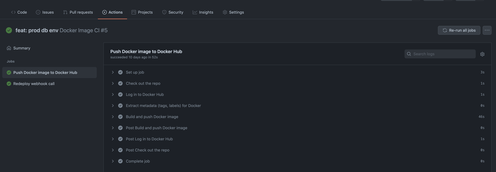
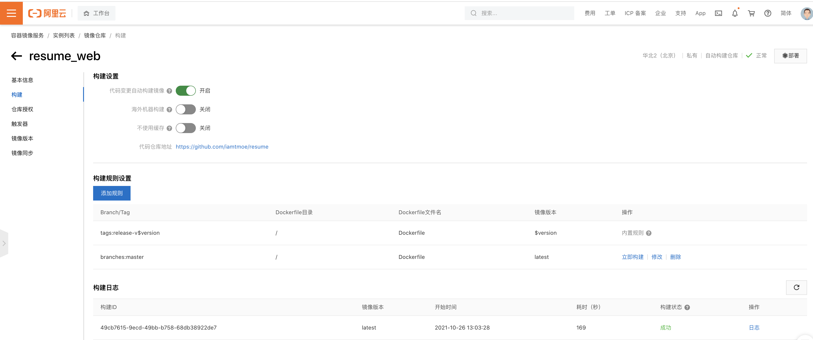

# webhook部署

## github action

项目根目录新增.github/workflow/docker-image.yml文件，或者也可以在github仓库页面上点击actions生成

```yml
name: Docker Image CI

on:
  push:
    branches: [ master ]
  # pull_request:
  #   branches: [ master ]

jobs:

  push_to_registry:
    name: Push Docker image to Docker Hub
    runs-on: ubuntu-latest
    steps:
      - name: Check out the repo
        uses: actions/checkout@v2
      
      - name: Log in to Docker Hub
        uses: docker/login-action@f054a8b539a109f9f41c372932f1ae047eff08c9
        with:
          username: ${{ secrets.DOCKER_USERNAME }}
          password: ${{ secrets.DOCKER_PASSWORD }}
      
      - name: Extract metadata (tags, labels) for Docker
        id: meta
        uses: docker/metadata-action@98669ae865ea3cffbcbaa878cf57c20bbf1c6c38
        with:
          images: iamtmoe/server
          tags: latest
      
      - name: Build and push Docker image
        uses: docker/build-push-action@ad44023a93711e3deb337508980b4b5e9bcdc5dc
        with:
          context: .
          push: true
          tags: ${{ steps.meta.outputs.tags }}
          labels: ${{ steps.meta.outputs.labels }}

  redeploy:
    name: Redeploy webhook call
    runs-on: ubuntu-latest
    needs: [push_to_registry]
    steps:
      - name: Deploy docker container webhook
        uses: joelwmale/webhook-action@master
        env:
          WEBHOOK_URL: ${{ secrets.DEPLOY_WEBHOOK_URL  }}
          # data: "{ 'myField': 'myFieldValue'}"
```

这样往master分支推代码会触发两个job,分别是构建镜像推送dockerhub和请求webhook,secrets.DOCKER_USERNAME是在仓库settings -> secrets 里配置



## webhook服务

当然可以自己起个服务处理http请求，这里用开源的go写的一个包

```sh
apt install webhook
mkdir hooks
cd hooks
touch supervisor.log
vim hooks.json
```

```json
[
  {
    "id": "server",
    "execute-command": "/home/tmoe/hooks/deploy/server.sh",
    "command-working-directory": "/home/tmoe/hooks/deploy",
    "response-message": "Redeploying server.",
    "trigger-rule": { // 规避非法请求
      "match": {
        "type": "value",
        "value": "secret-value",
        "parameter": {
          "source": "url",
          "name": "secret"
        }
      }
    }
  }
]
```

```sh
mkdir deploy
vim deploy/server.sh
```

```sh
#!/bin/bash
sudo docker pull iamtmoe/server:latest
sudo docker stop server
sudo docker system prune -f
sudo docker run -d --name=server iamtmoe/server:latest
```

`webhook -hooks /home/tmoe/hooks/hooks.json -port 9091 -verbose`

## 后台启动

```sh
sudo apt install supervisor
sudo vim /etc/supervisor/conf.d/webhooks.conf
```

```conf
[program:webhooks]
command=bash -c "webhook -hooks /home/tmoe/hooks/hooks.json -port 9090 -verbose"
redirect_stderr=true
autostart=true
autorestart=true
user=tmoe
numprocs=1
process_name=%(program_name)s_%(process_num)s
stdout_logfile=/home/tmoe/hooks/supervisor.log
environment=HOME="/home/tmoe",USER="tmoe"
```

```sh
sudo supervisorctl reread
sudo supervisorctl update
sudo supervisorctl start webhooks:*
sudo supervisorctl reload
```

## acr，阿里云容器镜像

dockerhub免费只能用一个私有仓库，不够的话可以使用ACR创建镜像仓库，但是使用上面的github action acr 登录成功，但是push镜像总是报错访问被拒绝，本地推也是能成功的，网上也搜不到答案，就给acr-login仓库提了个issue：<https://github.com/aliyun/acr-login/issues/12>感受下蹩脚英文:joy:。后来发现可以直接设置代码变更触发acr的镜像构建，issue等了很久也没反应就关掉了。然后设置触发器，填上webhook url，问题解决:tada:



## 参考链接

- <https://github.com/marketplace/actions/alibaba-cloud-container-registry-acr-login>
- <https://willbrowning.me/setting-up-automatic-deployment-and-builds-using-webhooks/>
