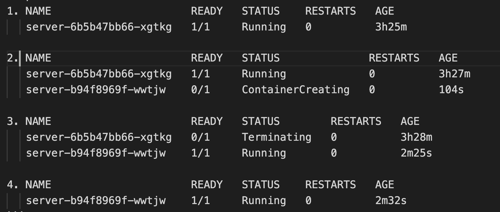

# 容器部署

## demo应用-server

用fastify快速原型一个应用

```js
import Fastify from 'fastify'
import fastifyPlugin from 'fastify-plugin'
import fastifyMongo from 'fastify-mongodb'

async function dbConnector (fastify, options) {
  fastify.register(fastifyMongo, {
    url: 'mongodb://<host>:27017/test'
  })
}
async function routes (fastify, options) {
  const opts = {
    schema: {
      response: {
        200: {
          type: 'object',
          properties: {
            hello: { type: 'string' }
          }
        }
      }
    }
  }
  fastify.get('/', opts, async (request, reply) => {
    const res = await fastify.mongo.db.collection('welcome').findOne()
    return res.sayHello
  })
}

const fastify = Fastify({
  logger: true
})

fastify.register(fastifyPlugin(dbConnector))
fastify.register(routes)

const start = async () => {
  try {
    await fastify.listen(3000, '0.0.0.0')
  } catch (err) {
    fastify.log.error(err)
    process.exit(1)
  }
}
start()
```

## node镜像构建

```dockerfile
# syntax=docker/dockerfile:1
FROM node:14.18.1-alpine
# FROM node:14.18.1-alpine as builder
RUN apk add --no-cache python g++ make
WORKDIR /app
COPY ["package.json", "yarn.lock", "./"]
RUN yarn
COPY . .
CMD ["node", "src/index.js"]
# RUN yarn build
# FROM nginx:latest
# COPY --from=builder /app/build /usr/share/nginx/html/
```

除了第一行是声明语法，其他的注释是构建前端镜像用的。这里有几点值得注意，参考<https://docs.docker.com/get-started/09_image_best/>

- node基础镜像选择alpine版的，相当于精简版的linux系统，安装包用`apk add`
- package.json单独copy，这是因为docker镜像构建是分层的，这样写能利用缓存提升构建速度
- 分阶段构建，--from=builder，第二阶段引用第一阶段的产物

然后  
`docker build . -t <user>/<repository>:<tag>`  
`docker push <user>/<repository>`

## 启动mongo

<https://hub.docker.com/_/mongo>
有了镜像开发我们不必再像以前安装数据库

`docker run --name mongo -p 27017:27017 -v /var/data/mongo:/data/db -d mongo`

这样就拉取官方mongo镜像启动起来了，这里-v指定数据存储目录，-p暴露端口。然后进入mongo shell

```sh
use test
db.welcome.insertOne({sayHello: "hello, world"})
```

## 部署到k8s

我本地使用的是docker desktop -> enable kubernetes（如果还安装了minikube, 先minikube stop)

### 创建资源

```yml
apiVersion: apps/v1
kind: Deployment
metadata:
  name: server
  namespace: default
spec:
  replicas: 1
  selector:
    matchLabels:
      app: server
  template:
    metadata:
      labels:
        app: server
    spec:
      containers:
      - name: server
        image: iamtmoe/server
      imagePullSecrets:
        - name: regcred
---
apiVersion: v1
kind: Service
metadata:
  name: server
  namespace: default
spec:
  type: NodePort
  selector:
    app: server
  ports:
  - port: 3000
    name: server
    targetPort: 3000
    nodePort: 30000
```

- 这里声明了两种k8s资源类型，一个Deployment和一个Service
- 这里的service是NodePort类型的，因为要本地访问端口
- deployment 声明了 imagePullSecrets，因为我把镜像仓库设置成了私有的，需要credential才能拉取，创建secret参考<https://kubernetes.io/docs/tasks/configure-pod-container/pull-image-private-registry/>

```sh
kubectl apply -f server.yml
curl localhost:30000 # 输出 hello, world
```

### 查看web面板

<https://kubernetes.io/docs/tasks/access-application-cluster/web-ui-dashboard/>

### 更新镜像

`kubectl set image deployment/server server=iamtmoe/server:latest`

可以看到滚动更新`kubectl get pod`

