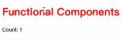

# 手写一个简易版的react

## 源代码

```html
<!DOCTYPE html>
<html lang="en">
<head>
    <meta charset="UTF-8">
    <meta name="viewport" content="width=device-width, initial-scale=1.0">
    <meta http-equiv="X-UA-Compatible" content="ie=edge">
    <title>Document</title>
</head>
<body>
    <div id="app"></div>
    <!-- 引入babel编译jsx -->
    <script src="https://unpkg.com/babel-standalone@6/babel.min.js"></script>
    <script>
        // babel默认转换后的代码使用React.createElement，所以我们挂上去
        const React = {}
        const MyReact = {}
        React.createElement = MyReact.createElement = (type, props, ...children) => {
            return {
                type,
                props: {
                    ...props,
                    children: children.map(child => typeof child == 'object'? child: {
                        type: 'TEXT_ELEMENT',
                        props: {
                            nodeValue: child,
                            children: []
                        }
                    })
                }
            }
        }
        let nextUnit = null
        let wipRoot = null
        let currentRoot = null
        let deletions = null
        let wipFiber = null
        let hookIndex = null
        // 递归更新dom树工作量大，为了不阻塞事件响应，采用分单元执行
        function workLoop() {
            // 渲染
            while(nextUnit) {
                nextUnit = performUnit(nextUnit)
            }
            // 全部渲染完成，一次性挂载，因为如果分次挂载可能会显示不完整UI
            if(!nextUnit && wipRoot) {
                commitRoot()
            }
            requestIdleCallback(workLoop)
        }
        function commitRoot() {
            deletions.forEach(commitWork)
            commitWork(wipRoot.child)
            currentRoot = wipRoot
            wipRoot = null
        }
        function commitWork(fiber) {
            if(!fiber) return
            let parentFiber = fiber.parent
            // 函数式组件的fiber不存在dom，需要一直向上查找
            while(!parentFiber.dom) {
                parentFiber = parentFiber.parent
            }
            parentDom = parentFiber.dom
            // 三种更新方式： 增加新节点，删除旧节点，更新节点
            if(fiber.effectTag === 'PLACEMENT' && fiber.dom != null) {
                parentDom.appendChild(fiber.dom)
            } else if(fiber.effectTag === 'DELETION') {
                commitDeletion(fiber, parentDom)
            } else if(fiber.effectTag === 'UPDATE' && fiber.dom != null) {
                updateDom(fiber.dom, fiber.alternate.props, fiber.props)
            }
            commitWork(fiber.child)
            commitWork(fiber.sibling)
        }
        function commitDeletion(fiber,parentDom) {
            if(fiber.dom) {
                parentDom.removeChild(fiber.dom)
            } else {
                commitDeletion(fiber.child, parentDom)
            }
        }
        function updateDom(dom, oldProps, newProps) {
            const isProps = propName => propName !== 'children' && !propName.startsWith('on')
            const isEvent = propName => propName.startsWith('on')
            const notInNew = propName => !(propName in newProps)
            const notInOld = propName => newProps[propName] !== oldProps[propName]
            Object.keys(oldProps).filter(isProps).filter(notInNew).forEach(oldPropKey => {
                dom[oldPropKey] = ''
            })
            Object.keys(newProps).filter(isProps).filter(notInOld).forEach(newPropKey => {
                dom[newPropKey] = newProps[newPropKey]
            })
            Object.keys(oldProps).filter(isEvent).filter(notInNew).forEach(eventProp => {
                const eventType = eventProp.toLowerCase().slice(2)
                dom.removeEventListener(eventType, oldProps[eventProp])
            })
            Object.keys(newProps).filter(isEvent).filter(notInOld).forEach(eventProp => {
                const eventType = eventProp.toLowerCase().slice(2)
                dom.removeEventListener(eventType, oldProps[eventProp])
                dom.addEventListener(eventType, newProps[eventProp])
            })
        }
        function render(ele, container) {
            wipRoot = nextUnit = {
                dom: container,
                props: {
                    children: [ele]
                },
                alternate: currentRoot
            }
            deletions = []
            requestIdleCallback(workLoop)
        }
        // 每次执行返回下一个fiber, 顺序是：first child -> next sibling -> parent's next sibling
        function performUnit(fiber) {
            if(fiber.type instanceof Function) {
                updateFunctionComponent(fiber)
            } else {
                updateHostComponent(fiber)
            }
            if(fiber.child) {
                return fiber.child
            }
            let nextSibling = fiber
            while(nextSibling) {
                if(nextSibling.sibling) {
                    return nextSibling.sibling
                }
                nextSibling = nextSibling.parent
            }
        }
        function updateHostComponent(fiber) {
            if(!fiber.dom) {
                fiber.dom = createDom(fiber)
            }
            let elements = fiber.props.children
            reconcileChildren(fiber, elements)
        }
        // 创建dom的时候文本节点、事件属性特殊处理
        function createDom(fiber) {
            const dom = fiber.type !== 'TEXT_ELEMENT' ?
                        document.createElement(fiber.type) :
                        document.createTextNode("")
            Object.keys(fiber.props).filter(propName => propName !== 'children').forEach(propName => {
                if(propName.startsWith('on')) {
                    const eventType = propName.toLowerCase().slice(2)
                    dom.addEventListener(eventType, fiber.props[propName])
                } else {
                    dom[propName] = fiber.props[propName]
                }
            })
            return dom
        }
        function updateFunctionComponent(fiber) {
            wipFiber = fiber
            hookIndex = 0
            wipFiber.hooks = []
            const children = [fiber.type(fiber.props)]
            reconcileChildren(fiber, children)
        }
        // state值为上个fiber的对应hook的state或者初始值，setState往hook队列里添加action, 下次渲染的时候取出来依次执行
        function useState(initial) {
            const oldHook = wipFiber && wipFiber.alternate && wipFiber.alternate.hooks[hookIndex]
            const hook = {
                state: oldHook? oldHook.state: initial,
                queue: [],
            }
            const actions = oldHook? oldHook.queue: []
            actions.forEach(action => {
                hook.state = action(hook.state)
            })
            const setState = action => {
                hook.queue.push(action)
                wipRoot = {
                    dom: currentRoot.dom,
                    props: currentRoot.props,
                    alternate: currentRoot,
                }
                nextUnit = wipRoot
                deletions = []
            }
            wipFiber.hooks.push(hook)
            hookIndex++
            return [hook.state, setState]
        }
        MyReact.useState = useState
        // 同时遍历旧fiber的child链表和新的元素数组，创建并链接新fiber,旧fiber打上删除标签
        // fiber有三个指针： child, sibling, parent
        function reconcileChildren(wipFiber, elements) {
            let index = 0
            let oldFiber = wipFiber.alternate && wipFiber.alternate.child
            let prevSibling = null
            while(index < elements.length || oldFiber != null) {
                let newFiber = null
                const element = elements[index]
                const sameType = oldFiber && element && oldFiber.type === element.type
                if(sameType) {
                    newFiber = {
                        type: oldFiber.type,
                        props: element.props,
                        dom: oldFiber.dom,
                        parent: wipFiber,
                        alternate: oldFiber,
                        effectTag: 'UPDATE'
                    }
                }
                if(element && !sameType) {
                    newFiber = {
                        type: element.type,
                        props: element.props,
                        dom: null,
                        parent: wipFiber,
                        alternate: null,
                        effectTag: 'PLACEMENT'
                    }
                }
                if(oldFiber && !sameType) {
                    oldFiber.effectTag = 'DELETION'
                    deletions.push(oldFiber)
                }
                if(oldFiber) {
                    oldFiber = oldFiber.sibling
                }
                if(index == 0) {
                    wipFiber.child = newFiber
                } else if(element) {
                    prevSibling.sibling = newFiber
                }
                if(newFiber) {
                    prevSibling = newFiber
                }
                index++
            }
        }
        MyReact.render = render
    </script>
    <script type="text/babel">
        function App() {
            const [count, setCount] = MyReact.useState(0)
            return (
                <div>
                    <h1 style="color: red;" onClick={() => setCount(count => ++count)}>Functional Components</h1>
                    <p>Count: {count}</p>
                </div>
            )
        }
        const domContainer = document.querySelector('#app');
        MyReact.render(<App />, domContainer);
    </script>
</body>
</html>
```

## 最终效果



## 项目地址

<https://cunzaizhimi.top/static/MyReact.html>

## 参考

[build your own react](https://pomb.us/build-your-own-react/)