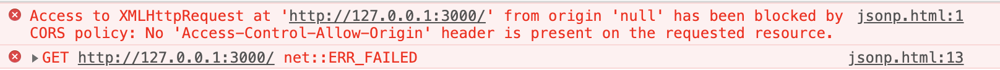
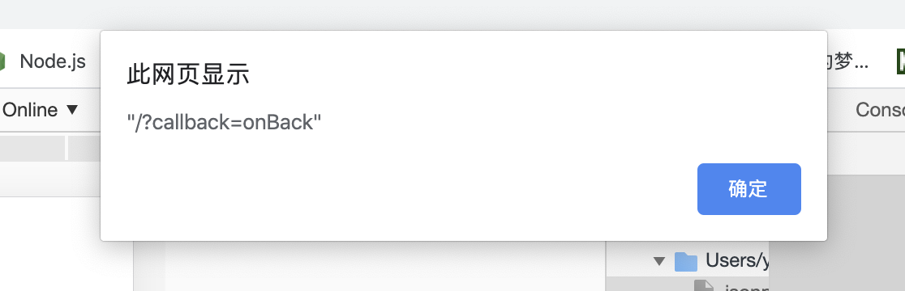
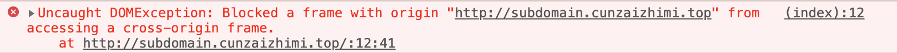

# 解决跨越问题的几种方法

## 参考

- [MDN: same-origin policy](https://developer.mozilla.org/en-US/docs/Web/Security/Same-origin_policy)

- [孙氏楼： 前端解决跨域的九种方法](https://www.cnblogs.com/sdcs/p/8484905.html) (***本文绝大部分参考该文！***)

## 问题由来

出于安全考虑，浏览器限制了不同源资源的交互，同源是指协议、域名、端口均相同

## 解决方案

### jsonp

先贴上演示代码

```js
// server.js
const http = require('http')
http.createServer((req, res) => {
    res.end(req.url)
}).listen(3000)
```

```html
<!-- index.html -->
<html lang="en">
<head>
    <meta charset="UTF-8">
    <meta name="viewport" content="width=device-width, initial-scale=1.0">
    <meta http-equiv="X-UA-Compatible" content="ie=edge">
    <title>Document</title>
</head>
<body>
    <script>
        const xhr = new XMLHttpRequest()
        xhr.open('GET', 'http://127.0.0.1:3000')
        xhr.send()
        xhr.onreadystatechange = (res) => {
            if(xhr.readyState === 4 && res.status === 200) {
                alert(res.responseText)
            }
        }
    </script>
</body>
</html>
```

```sh
node server.js
open index.html
```

打开浏览器控制台，看到如下报错：
  
使用jsonp方式

```js
//server.js
const http = require('http')
const qs = require('querystring')
http.createServer((req, res) => {
    const params = qs.parse(req.url.split('?')[1]);
    const fn = params.callback;

    // jsonp返回设置
    res.writeHead(200, { 'Content-Type': 'text/javascript' });
    res.write(fn + '(' + JSON.stringify(req.url) + ')');

    res.end();
}).listen(3000)
```

```html
<!-- index.html -->
<script>
    let script = document.createElement('script');
    script.type = 'text/javascript';

    // 传参并指定回调执行函数为onBack
    script.src = 'http://127.0.0.1:3000?callback=onBack';
    document.head.appendChild(script);

    // 回调执行函数
    function onBack(res) {
        alert(JSON.stringify(res));
    }
</script>
```

结果访问到了数据，如图：


### 设置document.domain为基础主域

```js
// subdomain.cunzaizhimi.top.js
const http = require('http')
http.createServer((req, res) => {
        res.end(`
<!DOCTYPE html>
<html lang="en">
<head>
    <meta charset="UTF-8">
    <meta name="viewport" content="width=device-width, initial-scale=1.0">
    <meta http-equiv="X-UA-Compatible" content="ie=edge">
    <title>Document</title>
</head>
<body>
    <script>
        window.parent.addPropBySubdomain = 'subdomain'
    </script>
</body>
</html>
        `)      
}).listen(4001)
```

```js
// cunzaizhimi.top.js
const http = require('http')
http.createServer((req, res) => {
        res.end(`
<!DOCTYPE html>
<html lang="en">
<head>
    <meta charset="UTF-8">
    <meta name="viewport" content="width=device-width, initial-scale=1.0">
    <meta http-equiv="X-UA-Compatible" content="ie=edge">
    <title>Document</title>
</head>
<body>
    <iframe src="http://subdomain.cunzaizhimi.top" frameborder="0"></iframe>
</body>
</html>
        `)      
}).listen(4000)
```

```nginx
server {
        server_name cunzaizhimi.top;
        location / {
                proxy_pass http://127.0.0.1:4000;
        }
}
server {
        server_name subdomain.cunzaizhimi.top;
        location / {
                proxy_pass http://127.0.0.1:4001;
        }
}
```

```sh
node cunzaizhimi.top.js &
node subdomain.cunzaizhimi.top.js &
nginx -s reload
```

访问<http://cunzaizhimi.top>, 浏览器控制台报错：  

双方都更改document.domain

```js
// cunzaizhimi.top.js
<iframe src="http://subdomain.cunzaizhimi.top" frameborder="0"></iframe>
<script>
    document.domain = 'cunzaizhimi.top'
    window.parent.addPropBySubdomain = 'subdomain'
</script>
```

```js
// subdomain.cunzaizhimi.top.js
<script>
    document.domain = 'cunzaizhimi.top'
    window.parent.addPropBySubdomain = 'subdomain'
</script>
```

重新访问<http://cunzaizhimi.top>，浏览器控制台查看window.addPropBySubdomain,输出“subdomain”

### iframe + location.hash

A、B不同域通信，借助与A同域的C页面实现  
A -> B iframe + location.hash  
B -> C iframe + location.hash  
C -> A window.parent.parent (MDN说window parent在跨域情况下是read only，但是经测试并不能访问, 请在评论区指正)

### iframe + window.name

A用iframe先加载跨域页面B, B的脚本里设置window.name, 然后切换iframe.contentWindow.location为同域空页面C, 通过iframe.contentWindow.name可以访问B设置的数据

### postMessage

targetWindow.postMessage(message, targetOrigin)  
targetWindow.addEventListener("message", ({data, origin, sourceWindow}) => {})

### CORS(cross-origin resource sharing)

属于http协议一部分，通过请求头来指定跨域访问策略。  
如果不需要携带cookie，只需后端设置响应头Access-Control-Allow-Origin: domain;  
否则前端需设置(xhr 或者 fetch)：withCredentials: true, 后端还需设置：Access-Control-Allow-Credentials, true  
此时cookie存取在访问接口的域内，如果要修改，可以配置nginx字段：proxy_cookie_domain,或者配置`node-http-proxy`的`cookieDomainRewrite`选项

### websocket

websocket协议支持跨域通信
